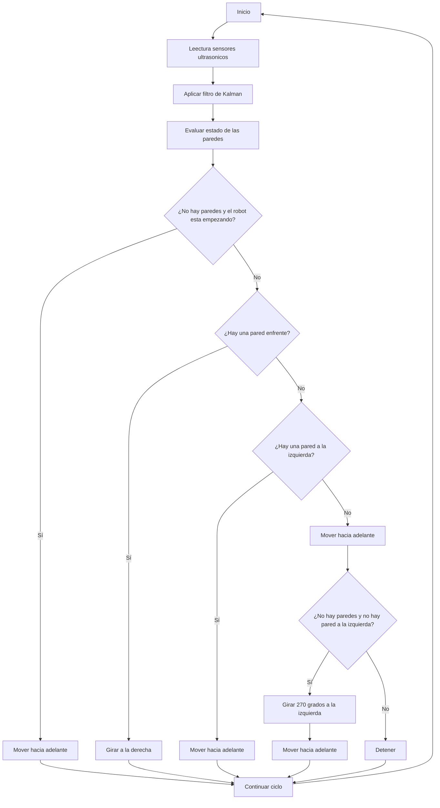

```mermaid
flowchart TD
    A[Inicio] --> P[Leectura sensores ultrasonicos]
    P --> Q[Aplicar filtro de Kalman] 
    Q -->R[Evaluar estado de las paredes]
    R -->B{¿No hay paredes y el robot esta empezando?}
    B -->|Sí| C[Mover hacia adelante]
    C --> X
    B -->|No| E{¿Hay una pared enfrente?}
    E -->|Sí| F[Girar a la derecha]
    F --> X
    E -->|No| H{¿Hay una pared a la izquierda?}
    H -->|Sí| I[Mover hacia adelante]
    I --> X
    H -->|No| K[Mover hacia adelante]
    K --> L{¿No hay paredes y no hay pared a la izquierda?}
    L -->|Sí| M[Girar 270 grados a la izquierda]
    M --> N[Mover hacia adelante]
    N --> X
    L -->|No| O[Detener]
    O --> X
    X[Continuar ciclo] --> A

```